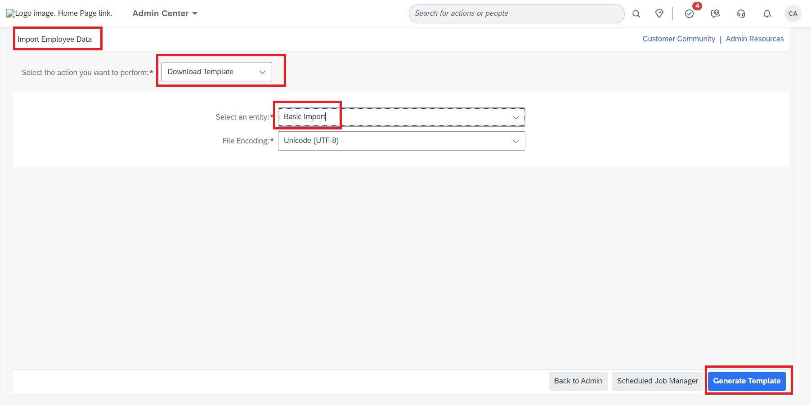
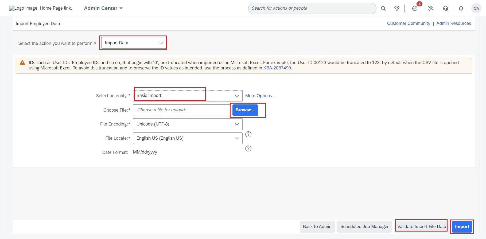
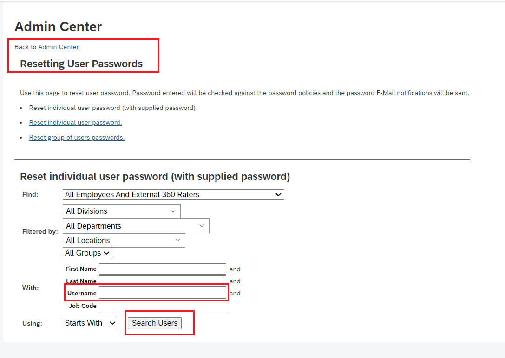
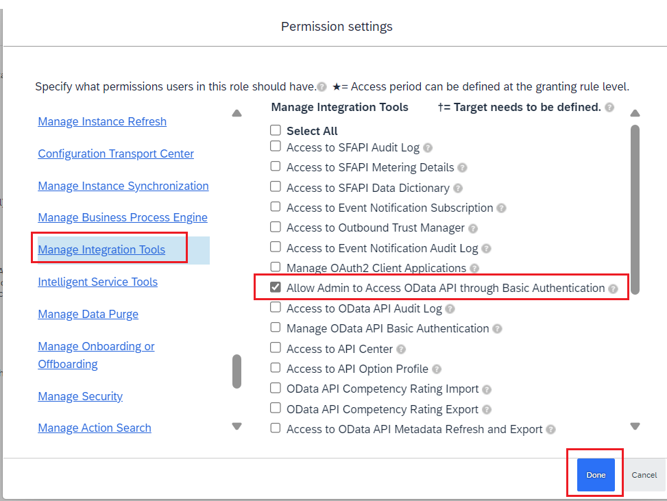

**Follow below steps to create a new SuccessFactors API user which you can use for JOULE configuration**
1. Login to SuccessFactors application.
2. Go to **Admin Center**-> **Import Employee Data** and Generate the template for Basic Import.

3. Enter relevant detail for following fields:
Status, UserId, Username, FirstName, LastName, Email ID, Manager (as NO_MANAGER ) and HR as (NO_HR) fields
4. **Save** the changes.
5. Go back to **Import Employee Data** screen and Import the csv file for Entity **Basic Import** after data validation:

6. Now, to reset the API user Password, go to **Admin Center**-> **Reset User Password**
7. Search for the newly created API user and Reset the password:

8. Assign below Permission to the newly created User under **Admin Center-> **Manage Permission Role** and navigate to **Manage Integration Tools**-> **Allow Admin to Access OData API through Basic Authentication**. Save your changes:

