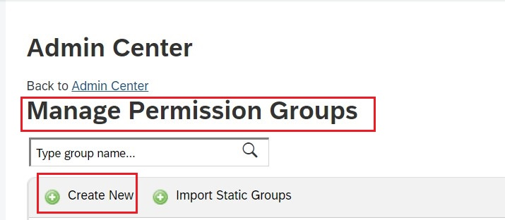
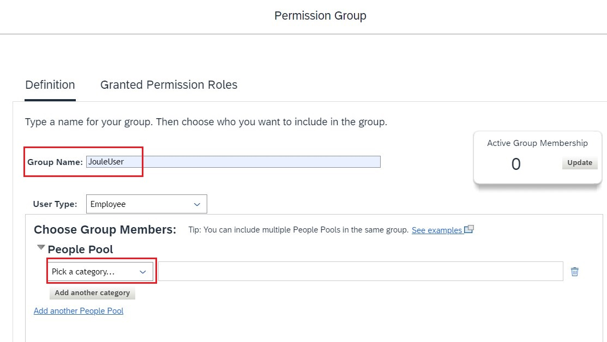
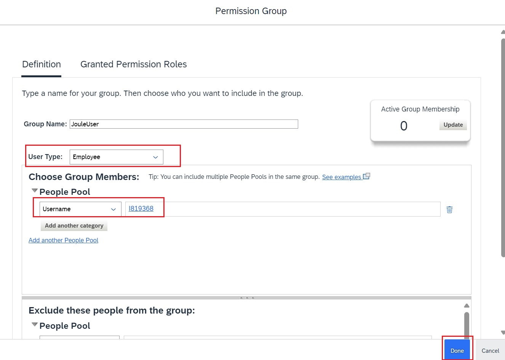
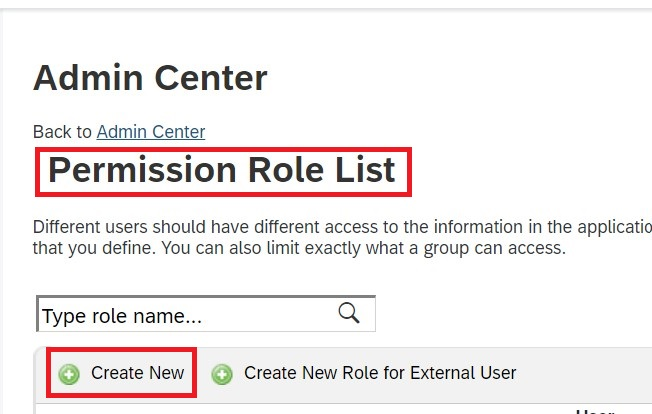
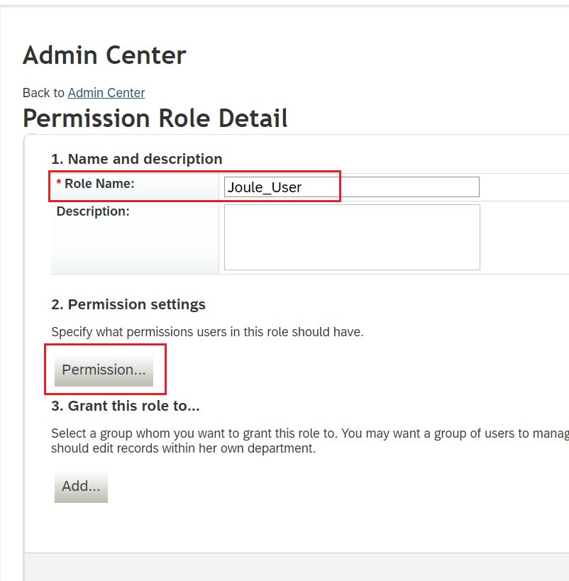
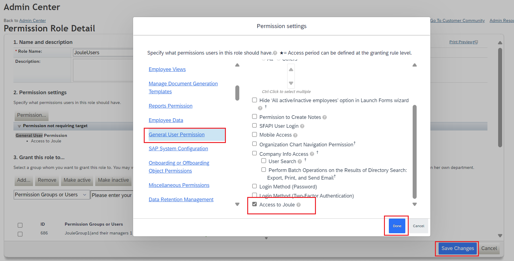
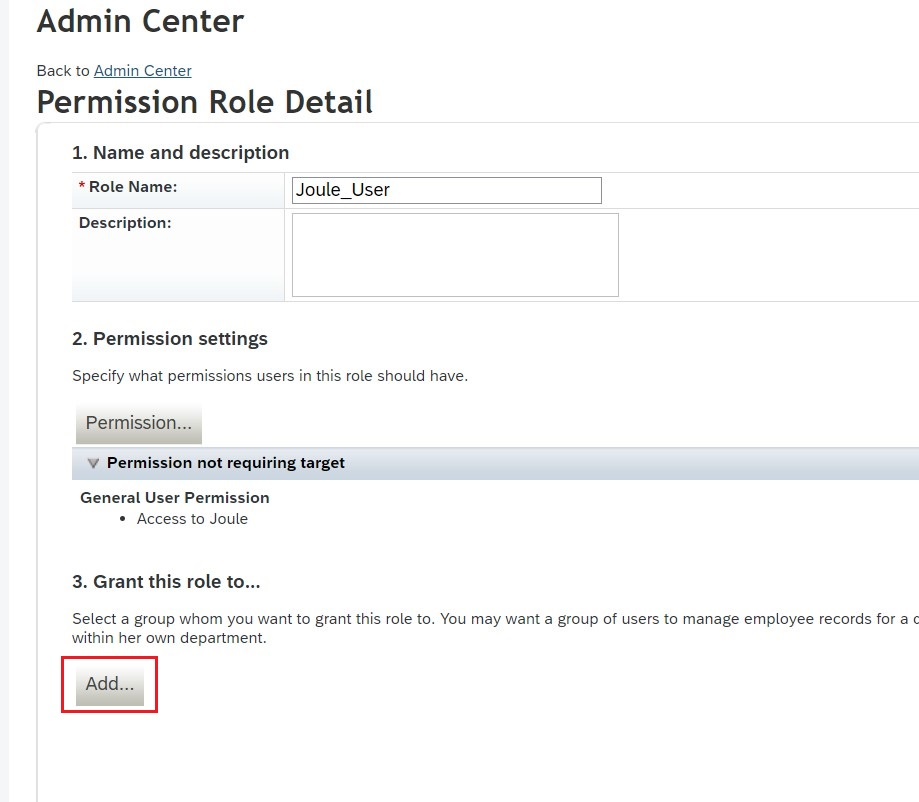
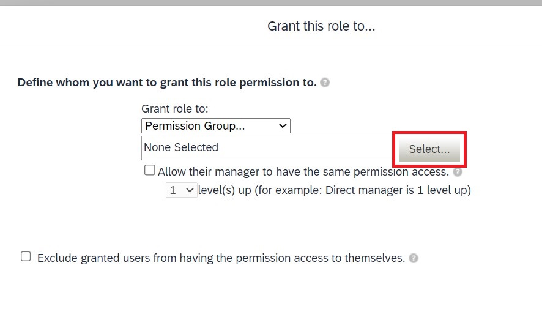
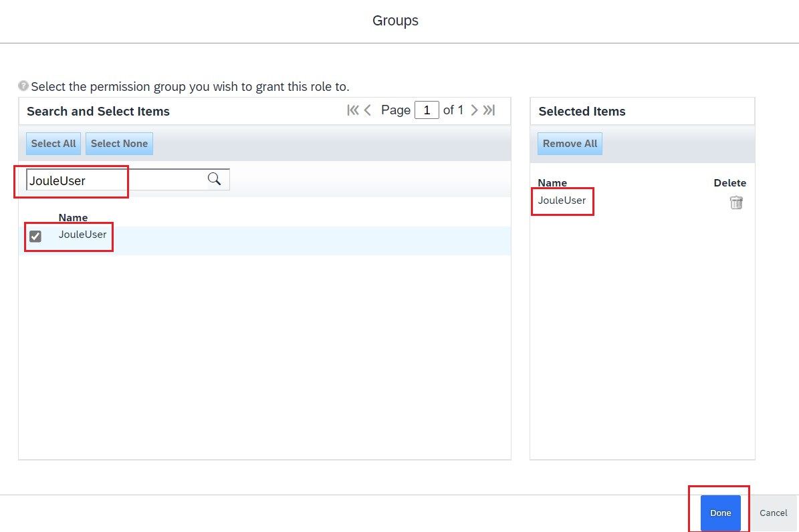
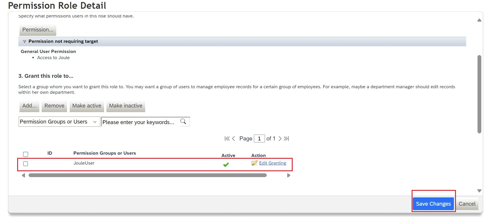

1. In SFSF instance, navigate to **Admin Center**-> **Manage Permission Groups**. 

3. Click **Create New** to create a new group for users who will require access to Joule.
4. Specify a **Group Name** and click **Pick a Category**. 

5. Search for the username and select the users who should be having JOULE access. Click **Done** 

6. Click **Done** again to save your changes for the group. 

7. Navigate to **Admin Center**-> **Manage Permission Roles**. 

8. Click **Create New**.  Specify a **Role Name** and click **Permissions**: 

9. Under **General User Permission >> Access to Joule** permission and click **Done**. 

11. Under **Grand this role too..** click **Add** and select the permission group created earlier.  
 

13. Save your changes.

**NOTE**: Above steps will allow authorized users to access the Joule functionality and based on user's data access for supported use case, information will be available. Also, this permission is only visible after booster execution in BTP subaccount.
