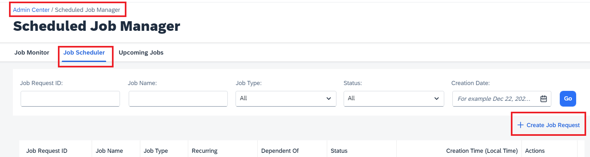
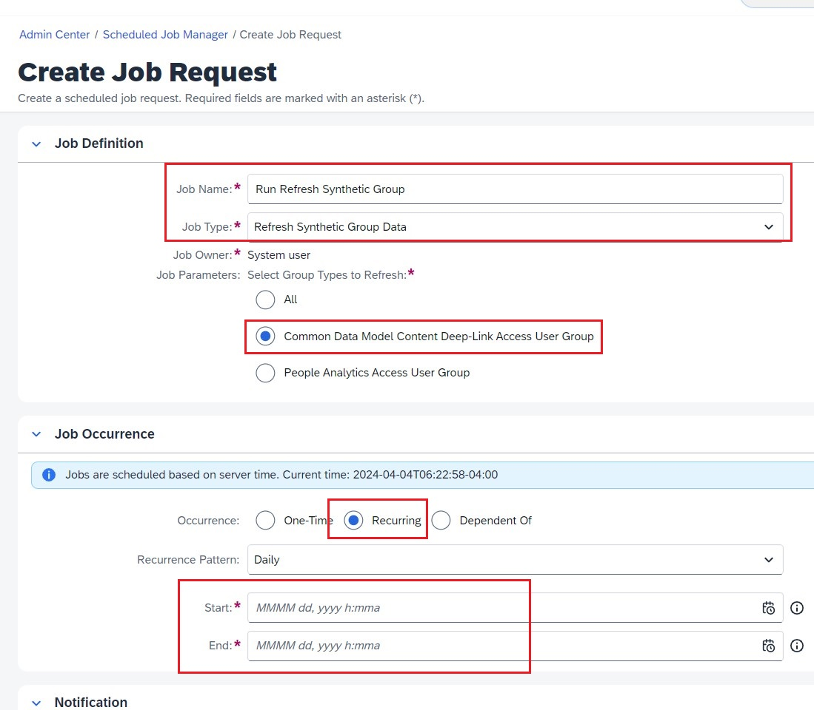

1. Login to SuccessFactors Application.
2. Navigate to **Admin Center**-> **Scheduled Job Manager**.
3. Under **Job Scheduler** tab, click on **Create Job Request**. 

4. Enter the following information:
  * **Job Name**
  * **Job Type:** Refresh Synthetic Group Data
  * **Job Parameters:** Common Data Model Content Deep-Link Access User Group
  * **Occurrence:** Recurring
  * **Recurrence Pattern**: Daily
  * **Start Date**: Use current date and set to execute in few minutes
  * **End Date**: Time frame of your choice
  

5. Click **Submit**. 

**Note**: This job must be successfully executed once before proceeding to the next step.  Set the start time of job to execute so that it executes in the next few minutes. 
**NOTE**: This job execution would make sure all the users who has been assigned deep link specific access are refreshed and synced correctly during Identity Provisioning sync to SAP WorkZone application.**
