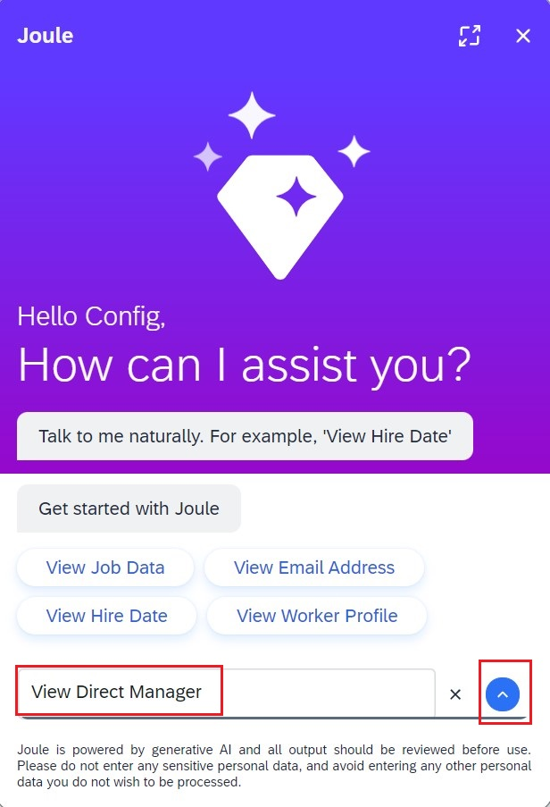
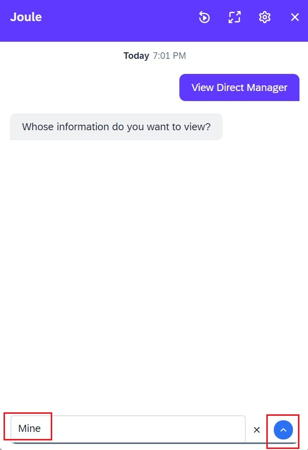
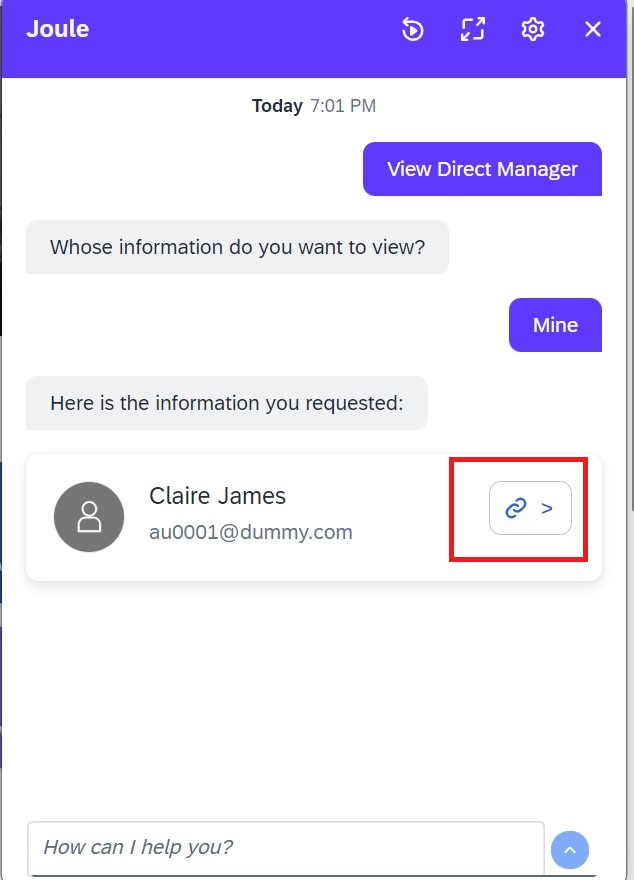

**NOTE**: To test Employee Central specific use cases you must have Employee Central Quick Links also enabled. See the pre-requisites section for more information on how to enable Employe Central Quick Links.  The full list of supported use cases for Joule are accessible from [here](https://help.sap.com/docs/joule/capabilities-guide/transactional-use-cases).

1. Login to SuccessFactors application with user who has been granted JOULE access. 
2. Click on **JOULE** icon visible on home page. 

3. This would launch JOULE and you are ready to test the supported use cases available for SuccessFactors.         
  

4. Type **View Direct Manager**.                         
 

5. Enter **Mine** to view your managers details.                       

6. Click on this Navigation link to view details of your manager profile.   

7. Confirm that you can successfully navigate to page where your managers profile is visilbe.
8. Test additional use cases as described in the link above.
