## **Configure SuccesssFactors as Source System in Identity Provisioning**

1. Download [**IdentityProvisioningFiles.zip**](https://github.com/hjudgesac/joule_integration_sfsf_public/raw/main/configure_identity_provisioning/files/IdentityProvisioningFiles.zip) that contains the pre-defined source and target systems required to setup this configuration. 
**Note**: A file should be automatically downloaded into your downloads folder.

2. Extract the zip file into a folder of your choice.  Confirm that the following 2 files are visible in the extracted folder:
 * **SuccessFactors-SF-Company-ID-Joule.json**
 * **WorkZone_Target_ForJoule.json** 
   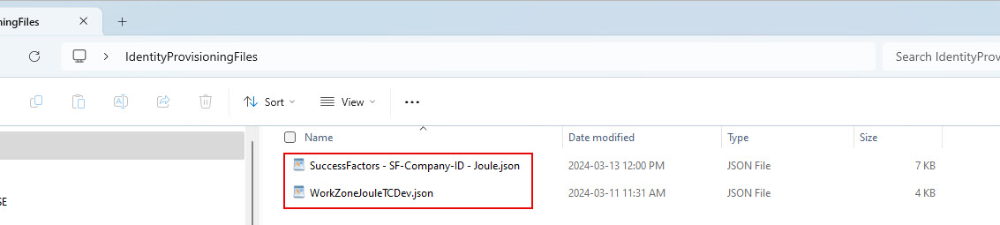
   
3. Access the administration console of SAP Cloud Identity Services tenant using one of the URL formats below:
  * https://your-ias-tenant.accounts.ondemand.com/admin
  * https://your-ias-tenant.accounts.cloud.sap/admin              
  **Note**: Substitute your-ias-tenant with your actual tenant name.

4. Authenticate using an administrator user.                 

5. From the menu, access **Identity Provisioning >> Source Systems**. 

6. Under **Source Systems** click **+Add** icon. 
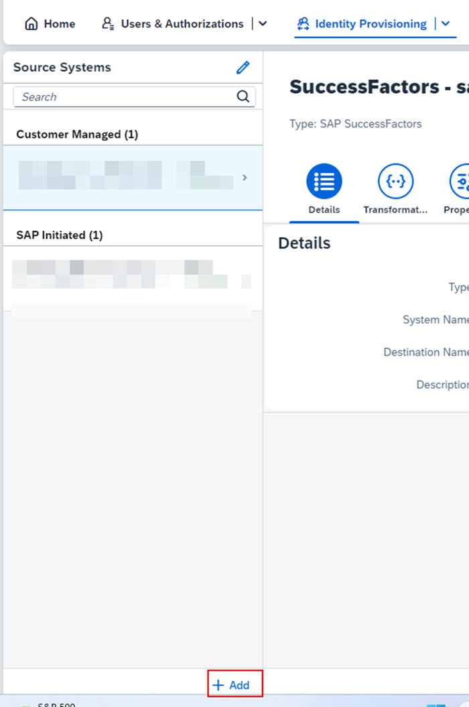

7. Click **Browse** to import a pre-defined source system configuration. 
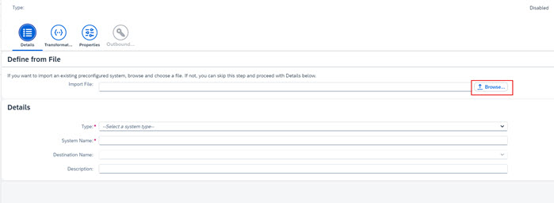

8. Select the **SuccessFactors-SF-Company-ID-Joule.json** file downloaded earlier and click **Open**.

9. Update the **System Name** field and put in your SuccessFactors system company ID and click **Save**. 
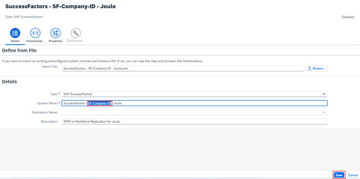

10. Click on **Properties** and replace the placeholders values with appropriate values for your setup using the information below:
 * **sf.company.id** : Replace with placeholder value with your actual SuccessFactors CompanyID.  For eg. DemoCompany in my screenshot
 * **URL** : Specify the API URL corresponding to your SuccessFactors instance.  For eg. https://api8.cert.successfactors.com in my setup.  Refer to the preparation steps if unsure of what URL to use.
 * **sf.user.filter** : Update the **userName** filter to include your own SuccessFactors users.  Use **or** to add additional users who should be replicated into Work Zone when this job is run later.             
**Note**: The reason for using a filter for specific users is so that we don't replicate the full SuccessFactors user base into Work Zone.  This setup will make it easier to test with few users first before rolling out to larger number of users.  The userName part of the filter can be removed later if full user synch is required. 
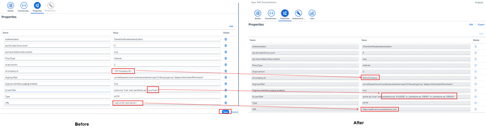

11. Click **Save**.
12. Click on **Outbound  Certificates** icon and click **Download Certificate** icon.  This will download the certificate into your downloads folder.
**Note**: This certificate will need to be imported into SAP SuccessFactors system in later steps. 
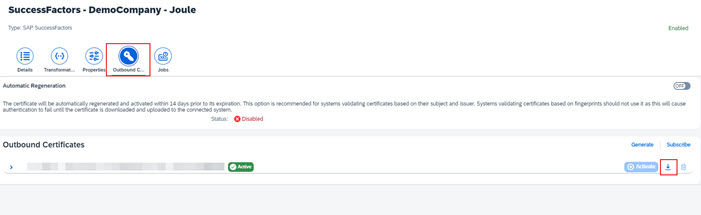

## **Configure SAP Build Work Zone, standard edition as a target system in Identity Provisioning**

1. From the menu, access **Identity Provisioning >> Target Systems**.       
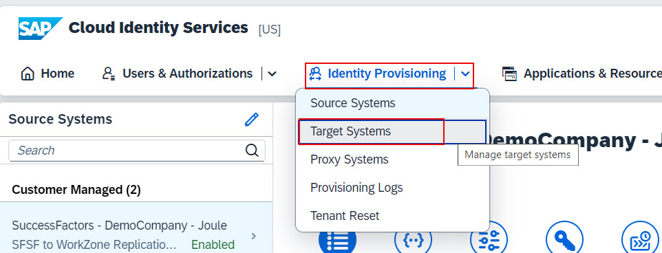

2. Under **Target Systems** click **+Add** icon.                  
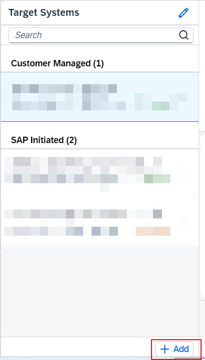

3. Click **Browse** to import a pre-defined target system configuration.
4. Select the **WorkZone_Target_ForJoule.json** file downloaded earlier and click **Open**.       
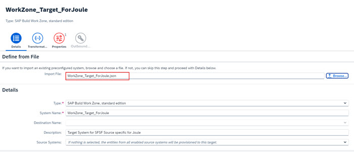

5. From the **Source System** dropdown make sure to select the source system created earlier.  For eg. **SuccessFactors - DemoCompany-Joule** in my screenshot.   
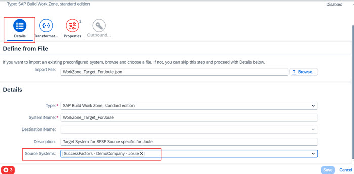

6. Switch to the **Properties** tab and update the following placeholders with the appropriate values for your system:
 * **cflp.providerId**: <-- **ID** of the content provider create in Work Zone.  **SFSF** in my case -->
 * **URL**: <--**portal-service** url from the key file downloaded earlier when we create Work Zone instance in BTP-->
 * **OAuth2TokenServiceURL**: <--**url** field from the key file downloaded earlier.  Make sure to add **/oauth/token** to end of the URL-->
 * **User**: <--**clientid** from key file downloaded earlier-->
 * **Password**: <--**clientsecret** from key file downloaded earlier--> 
 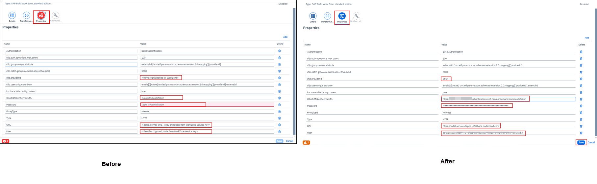
 
 7. Click **Save**
 
## **Import the certificate into SAP SuccessFactors**

1. Log into SAP SuccessFactors using an admin user.
2. Access **Security Center** from search area. 

3. Click **X.509 Certificate Mapping** tile.                       
**Note**: If the tile is not visible, make sure you have the appropriate permissions assigned to your SuccessFactors admin user.  See preparation section.          
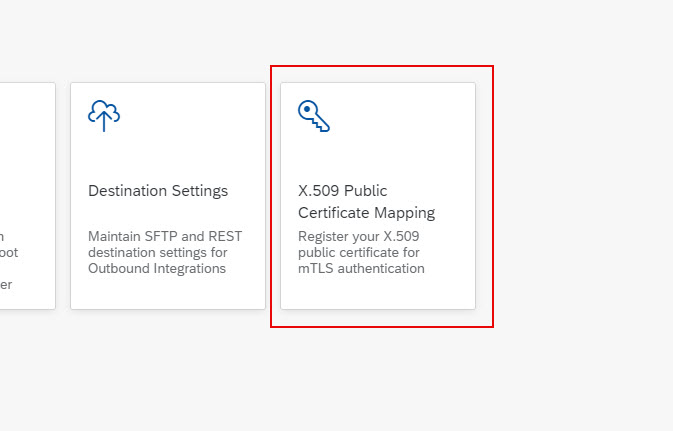

6. Click the **Add** button.                          
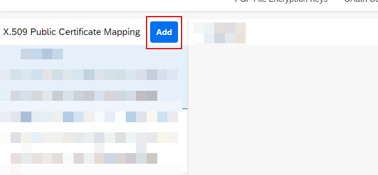

7. Specify the following information and **Save** your configuration:
 * Configuration Name: <--Name of your choice--->
 * Integration Name: Select **Identity Provisioning Service** from the dropdown.
 * Certificate File: Upload the certificate file downloaded from the SuccessFactors source system we created in earlier steps.
 * Login Name: <--Leave blank--> 
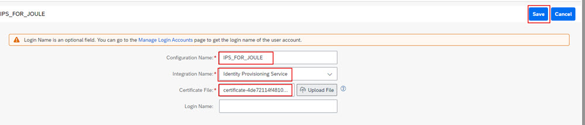

8. Confirm the certificate is successfully uploaded in SuccessFactors.               
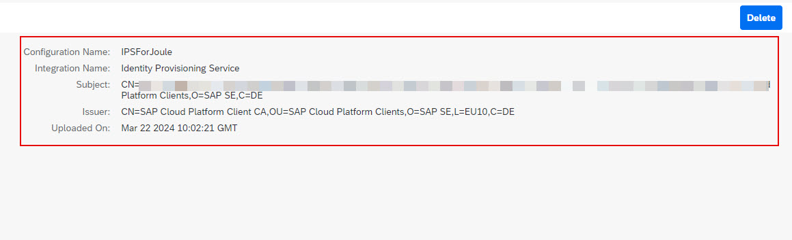
