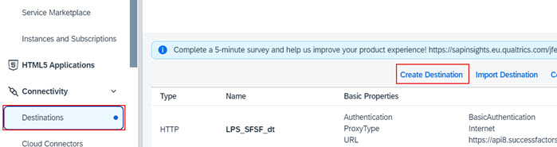
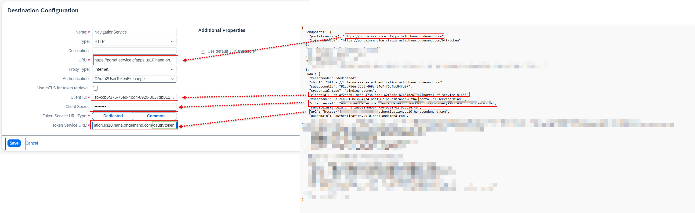
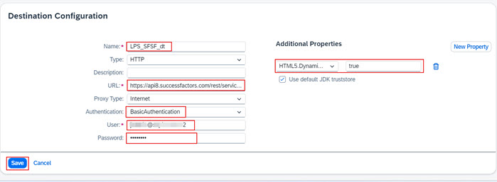
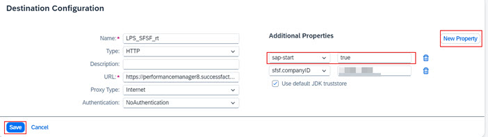

1. From the Navigation Pane on the left, select **Connectivity >> Destinations**.  Click **Create Destination**. 

2. Specify the information below to create the destination and click **Save**:
  * Name: **NavigationService**
  * Type: **HTTP**
  * URL: <--**portal-service** url from the key file downloaded earlier-->
  * Proxy Type: **Internet**
  * Authentication: **OAuth2UserTokenExchange**
  * Token Service URL: <--**url** field from the key file downloaded earlier.  Make sure to add **/oauth/token** to end of the URL-->
  * Token Service URL Type: **Dedicated**
  * Client ID: <--**clientid** from key file downloaded earlier-->
  * Client Secret: <--**clientsecret** from key file downloaded earlier-->
  * Use default JDK truststore: **checked** 

 
3. Click **Create Destinations** to create a new destination using the information below and click **Save**:
  * Name: **LPS_SFSF_dt**
  * Type: **HTTP**
  * URL: <-- https://yourSFSFtenantAPIURL/rest/servicesfoundation/sfcdmcontentservice/v1/SFCDMContent  (see preparation section to find the API URL for your SuccessFactors instance-->
  * Proxy Type: **Internet**
  * Authentication: **BasicAuthentication**
  * User: <-- SAP SuccessFactors username with oData API access and company ID in the format of **username@COMPANYID** (see preparation section for more information on how to create this API User) -->
  * Password: <-- Password for the user above -->
  * Use default JDK truststore: **checked**
  * **New Property** >> **HTML5.DynamicDestination**: **true** 
 
  
4. Click the pencil icon to edit the **LPS_SFSF_rt** destination that is automatically created by the booster you ran earlier. 

5. Click **New Property** and type **sap-start**.  Set the value of of the propery to **true** and **Save** the destination. 
             
**Note**: **sap-start** must be all in lower case.
