## **Create Subaccount and Cloud Foundry Space**

1. Access [BTP Cockpit URL](https://cockpit.btp.cloud.sap).
2. Select the BTP Global Account that has the Joule entitlements and click **Continue**.                         

3. From the Navigation Pane on the left, select **Account Explorer**.  Click **Create** >> **Subaccount**.
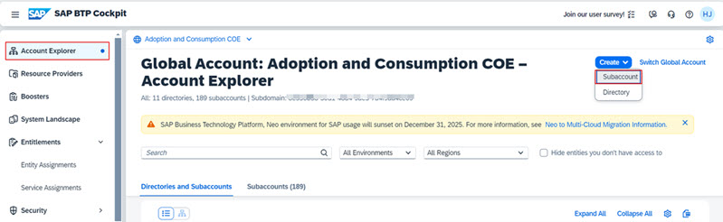

4. Specify **Display Name** and **Region** and click **Create**.                             
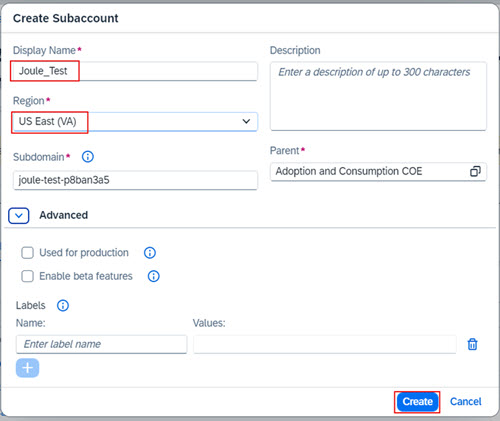   
**Note**: The **Region** must be from one of the supported data centers for Joule and correspond to your SuccessFactors tenant.  See [Data Center Mapping between SAP SuccessFactors and Joule](https://help.sap.com/docs/joule/serviceguide/data-center-mapping-between-sap-successfactors-and-joule)

5. Click **Enable Cloud Foundry**. 
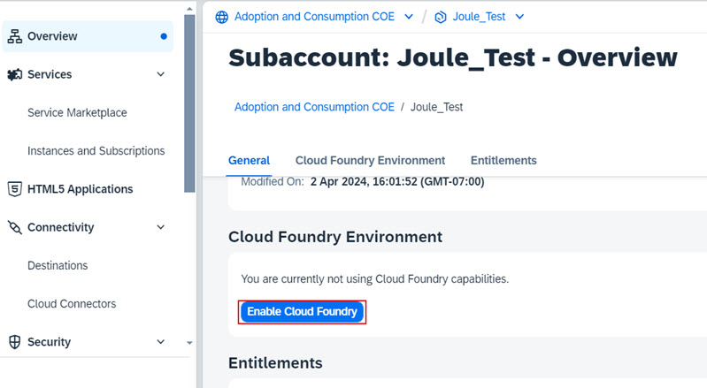

6. Leave the default settings and click **Create**.              
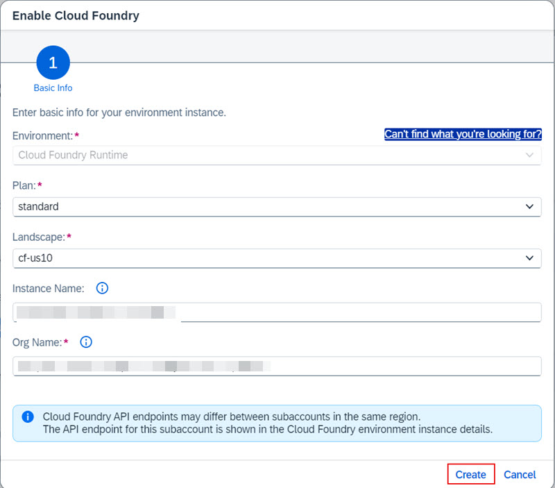

7. From the Navigation Pane, expand **Cloud Foundry** and click **Spaces**.                                                         
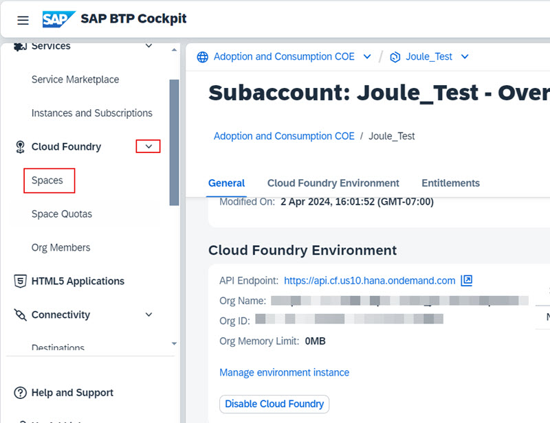

8. Click **Create Space**.                                                                                                                   
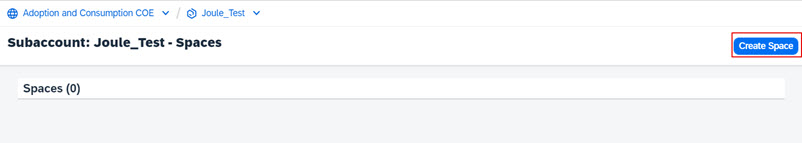

9. Specify a **Space Name** and click **Create**.                                       
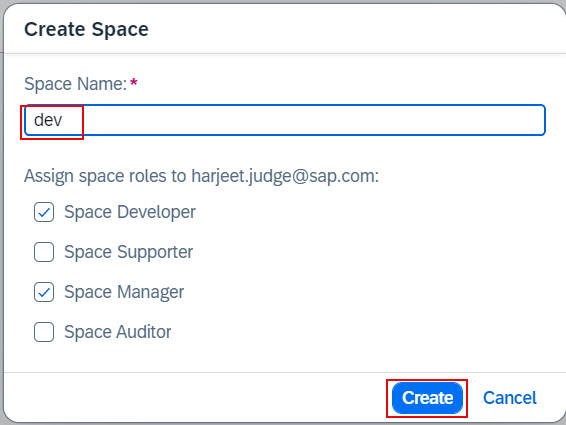

## **Add Entitlements**

1. From the Navigation Pane, select **Entitlements** and click **Edit**.
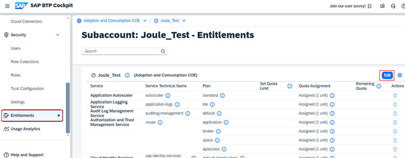

2. Click **Add Service Plans**.                           
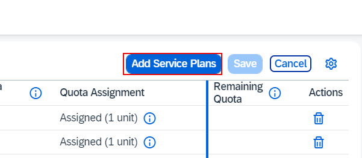

3. Search for "Joule".  Click **Joule** and choose **foundation (Application)** from the list of available plans.

4. Search for "workzone".  Click **SAP Build Work Zone, standard edition** and choose the **foundation** and **foundation (Application)** plans.  Click **Add 3 Service Plans**.                                       
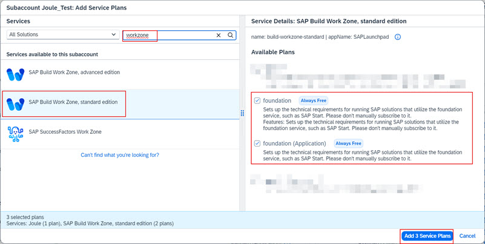

5. Click **Save**.                      
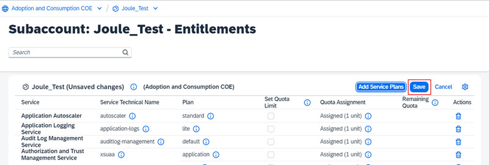

## **Add Trusted Domains**

1. From the Navigation Pane, select **Settings** and click **Add**.

2. Add your **SuccessFactor tenant domain** and click **Add**.  For example, https:///hcm-us10.hr.cloud.sap.                  
**NOTE**:  Do not add trailing slash(/) at the end of the URL.     
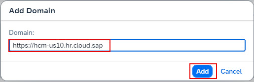
 
