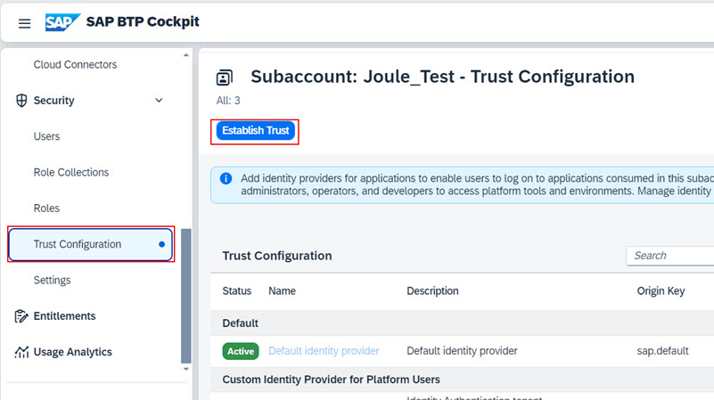
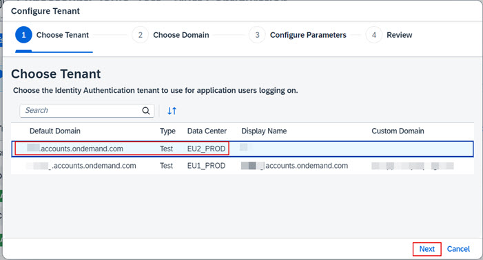
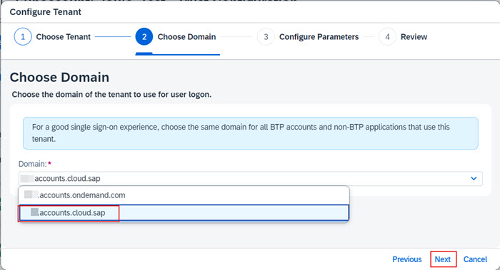
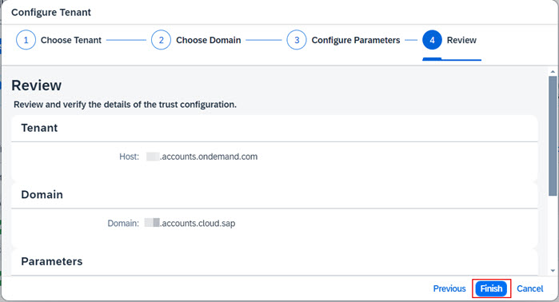
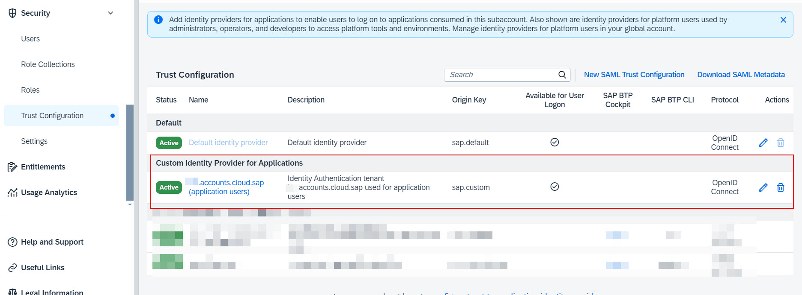
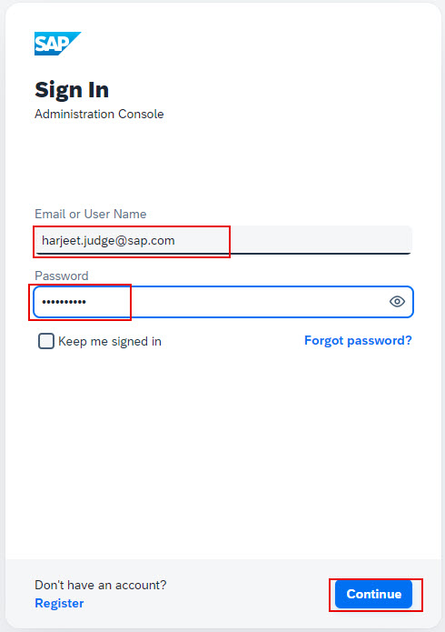

## **Create trust between BTP Subaccount and SAP Cloud Identity Authentication Service**

1. From the Navigation Pane on the left, select **Trust Configuration**.  Click **Establish Trust**. 

2. From the list of available SAP Cloud Identity Services tenants, choose the one that is also used by your SuccessFactors tenant and click **Next**.      
**Note**: It's important to the choose the correct SAP Cloud Identity Services tenant.  The tenant chosen here must be the same as the one used by SuccessFactors instance for which Joule is being configured.  Refer to the preparation steps section if unsure of what tenant to select from the list.       
   

3. Choose the appropriate domain for your SAP Cloud Identity Services tenant.  Select either **ias.accounts.ondemand.com** or **ias.accounts.cloud.sap** and click **Next**.            
**Note**: Refer to the preparation steps section if you are unsure of which domain to choose.            
       

4. Leave the default settings and click **Next**.         

5. Review the information is correct and click **Finish**.                                                        

6. Confirm the new trust with SAP Cloud Identity Services is visible under **Custom Identity Provider for Applications**.                                      

## **Update application configuration in SAP Cloud Identity Authentication Service**

1. Access the administration console of SAP Cloud Identity Services tenant using one of the URL formats below:
  * https://your-ias-tenant.accounts.ondemand.com/admin
  * https://your-ias-tenant.accounts.cloud.sap/admin              
**Note**: Substitute your-ias-tenant with your actual tenant's name.

2. Authenticate using an administrator user.               

3. From the menu, access **Applications & Resource >> Applications**. 

4. Select your SuccessFactors application and click on **Conditional Authentication**. 

5. Validate the **Conditional Authentication** settings for the application, but do not change anything in the existing setup.  The settings here would fall into one of the following 3 scenarios:
 * Scenario 1: SuccessFactors application is setup to use Identity Authentication as the Default Identity Provider
 * Scenario 2: SuccessFactors application is setup to use Identity Authentication as the Default Identity Provider but there are conditional rules setup to delegate   authentication to a 3rd party corporate IDP
 * Scenario 3: 3rd party IDP is setup as the Default Identity Provider eg. OKTA in my screenshot below. 

6. Switch to the application created for the BTP subaccount where Joule will be setup.  Set the **Conditional Authentication** settings for this application to match exactly what was set for the SuccessFactors application.  For eg. If the SuccessFactors application is setup with Scenario 3, you must also change Default Identifier in this application accordingly.                       
**Note**: This application is automatically created in SAP Cloud Identity Authentication when we established trust from BTP subaccount in earlier steps.                

## **Update Trusted Domains settings**

1. From the menu, access **Applications & Resource >> Tenant Settings**. 

2. Click **Customization** >> **Trusted Domains**. 

3. If necessary, click **Add** to add the domain of your SuccessFactors tenant and click **Save**.  For eg. if your SuccessFactors tenants URL is <--https://hcm-us10.hr.cloud.sap/login?company=yourcompany --> the entry to add is ***.hr.cloud.sap**.         

