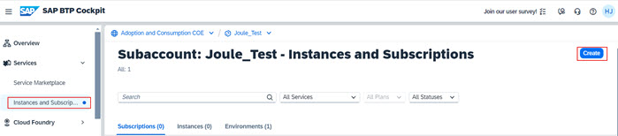
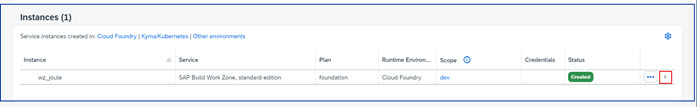
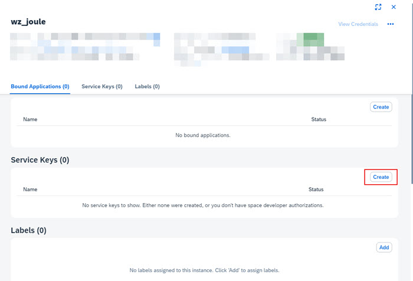
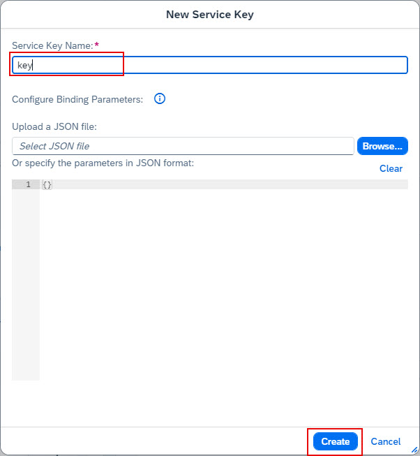
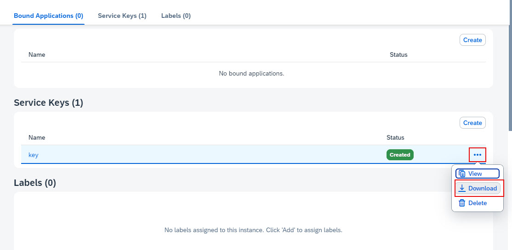
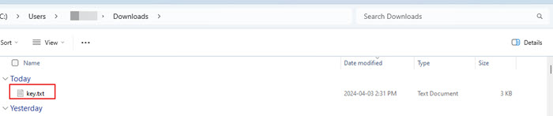
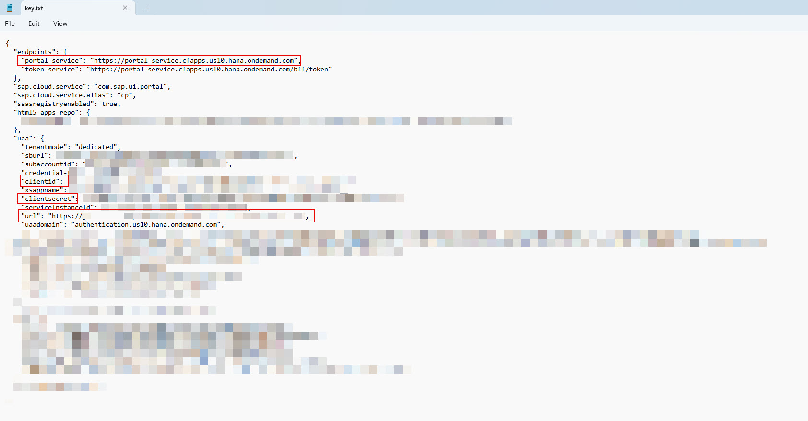

1. From the Navigation Pane on the left, select **Instances and Subscriptions**.  Click **Create**.  

2. Select **SAP Build Work Zone, standard edition** from Service dropdown and **Subscriptions >> foundation** from the Plan dropdown. Click **Create**.  
   

3. Under **Instances and Subscriptions** click **Create** button again. 
4. Select **SAP Build Work Zone, standard edition** from Service dropdown and **instances >> foundation** from the Plan dropdown. 
  

5. Specify an **Instance Name** and click **Create**.          

6. Confirm the subscription to the Work Zone and creation of the instance is successful.                                                         

7. Click the **navigation arrow** to view the Work Zone instace details.                                      

8. Under **Service Keys** click **Create**.                                                        

9. Specify a **Service Key Name** and click **Create**.                   

10. Click **Actions** icon next to the key and click **Download**. 

11. Confirm the **key.txt** file is successfully downloaded into your downloads folder. 

12. Open the file in a text editor to review its content.  Make note of the items in red as they will be required for further configuration. 

