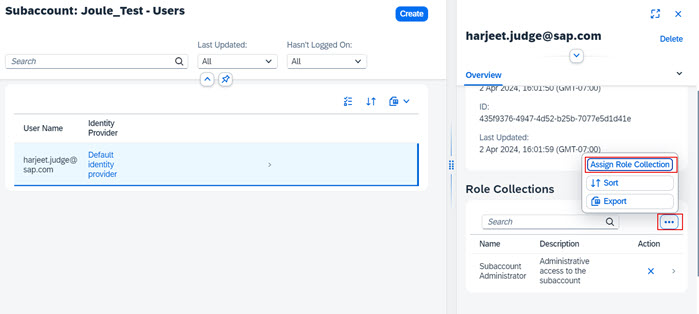
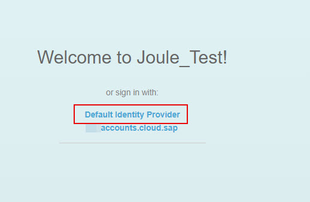

## Create SAP Build Work Zone Instance and Subscription
1. From the Navigation Pane on the left, select **Instances and Subscriptions**.  Click **Create**.  

2. Select **SAP Build Work Zone, standard edition** from Service dropdown and **Subscriptions >> foundation** from the Plan dropdown. Click **Create**.  
   

3. Under **Instances and Subscriptions** click **Create** button again. 
4. Select **SAP Build Work Zone, standard edition** from Service dropdown and **instances >> foundation** from the Plan dropdown. 
  

5. Specify an **Instance Name** and click **Create**.          

6. Confirm the subscription to the Work Zone and creation of the instance is successful.                                                         

7. Click the **navigation arrow** to view the Work Zone instace details.                                      

8. Under **Service Keys** click **Create**.                                                        

9. Specify a **Service Key Name** and click **Create**.                   

10. Click **Actions** icon next to the key and click **Download**. 

11. Confirm the **key.txt** file is successfully downloaded into your downloads folder. 

12. Open the file in a text editor to review its content.  Make note of the items in red as they will be required for further configuration. 

## Configure SAP Build Work Zone to use SAP Cloud Identity Services - Identity Authentication
For more information on this, see [Switching to SAP Cloud Identity Services - Identity Authentication](https://help.sap.com/docs/build-work-zone-standard-edition/sap-build-work-zone-standard-edition/switching-to-sap-cloud-identity-services-identity-authentication?q=identity+authentication)
1. From the Navigation Pane in BTP Cockpit, select **Security >> Users** and click the arrow to open user details. 

2. Scroll down to role collections section and click **Additional Details** icon >> **Assign Role Collections**.  
   

3. Select the **Launchpad_Admin** and click **Assign Role Collection**. 
 

4. From the Navigation Pane on the left, select **Instances and Subscriptions***. Click **SAP Build Work Zone, standard edition** to launch the application.   
 

5. Select **Default Identity Provider**. 

6. Click the **Settings** icon and select **Identity Authentication** tab.  Make sure the checkbox is selected and click **Enable**. 

7. Confirm the Identity Authentication is enabled successfully. 

8.  In the BTP cockpit, navigate to your BTP Global Account. 

15.  Under **System Landscape** and confirm that you now also see a new system of type **SAP Build Work Zone** listed as a registered system.  This system is automatically added to the System Landscape from the SAP Build Work Zone subscription that you created earlier.  Make a note of the **System Name** for this system as it will come in handy later when executing the Joule booster. 

