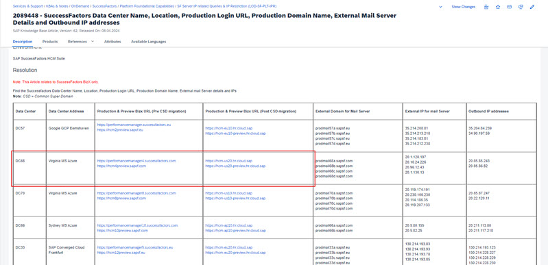
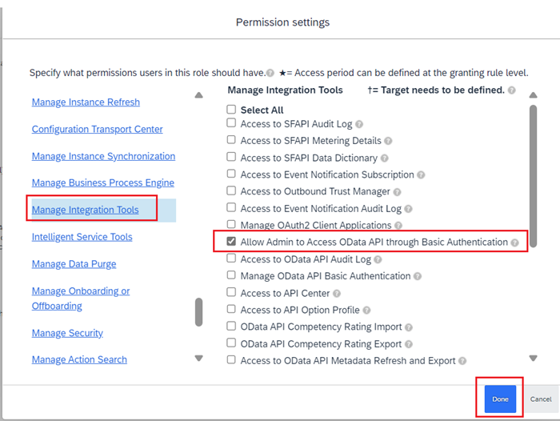
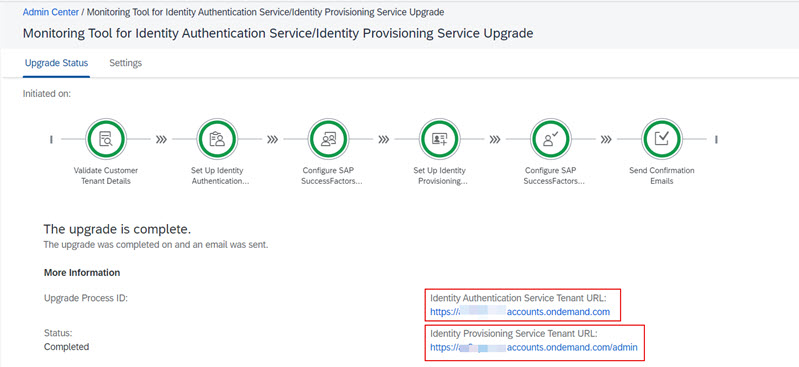
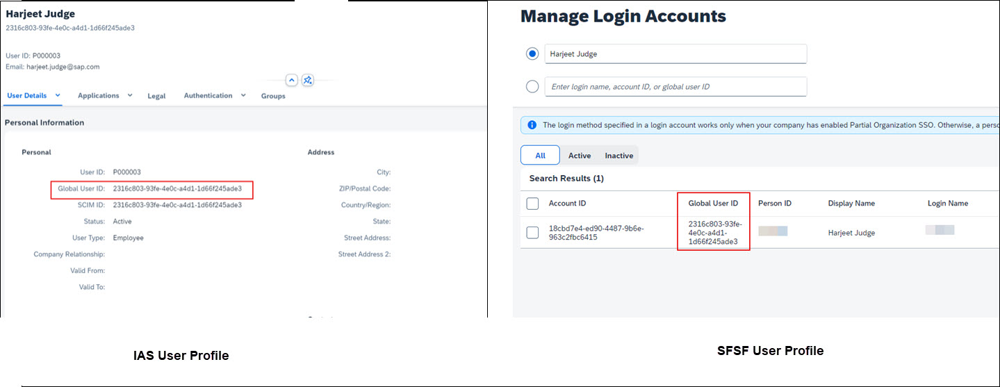

Before you can activate Joule there are certain number of pre-requisites that must be met.  This section describes those pre-requisites and also outlines some details that need to be captured prior to running through the activation steps.

## 1. Verify Global Account Entitlements

Verify that your global account is configured with the following entitlements. For more information, see [Managing Entitlements and Quotas Using the Cockpit](https://help.sap.com/docs/BTP/65de2977205c403bbc107264b8eccf4b/c8248745dde24afb91479361de336111.html).

| Application     | Technical Name | Plan        | Required Quota | Remaining Quota |
| ----------- | ----------- | ----------- | -------------- | --------------- |
| Joule      | das-application      | foundation       |     1            |          limited       |
| SAP Build Work Zone, standard edition   | SAPLaunchpad       | foundation or standard       |      1           |       limited          |

| Service     | Technical Name | Plan        | Required Quota | Remaining Quota |
| ----------- | ----------- | ----------- | -------------- | --------------- |
| SAP Build Work Zone, standard edition      | build-workzone-standard      | foundation or standard      |     1            |          limited       |

## 2. Determine SuccessFactors Data Center

In order to validate whether SuccessFactors instance can be setup for Joule, you will need to find the correct data center for your SAP SuccessFactors instance.  To learn more, visit [2089448 - SuccessFactors Data Center Name, Location, Production Login URL, Production Domain Name, External Mail Server Details and Outbound IP addresses](https://me.sap.com/notes/0002089448)

For example, DC68 data center tenants the screenshot shows the corresponding SuccessFactors tenant URLs. 

**Note**: If your SuccessFactors tenant is using common super domain, make note of the **Pre CSD Migration URL** of your tenant as well.  This URL will be used when running the booster in the BTP Global Account.

## 3. Verify SuccessFactors Data Center

SAP Joule is supported in subset of the SAP SuccessFactors datacenters.  Confirm that your SuccessFactors tenant is in the list of supported data centers for Joule.  See the list of [Data Center Mapping between SAP SuccessFactors and Joule](https://help.sap.com/docs/joule/serviceguide/data-center-mapping-between-sap-successfactors-and-joule).

## 4. Find API URLs for SuccessFactors tenant

We need to know the **API Server** and **mTLS Certificate Server** URLs for our SuccessFactors tenant.  This information can be found here:
[List of SFSF API Servers](https://help.sap.com/docs/SAP_SUCCESSFACTORS_PLATFORM/d599f15995d348a1b45ba5603e2aba9b/af2b8d5437494b12be88fe374eba75b6.html) 

For example, for DC68 production SuccessFactors tenants the corresponding **API Server** and **mTLS Certificate Server** URLs for our SuccessFactors tenant are:   
**API Server**: https://api4.successfactors.com/                         
**mTLS Certificate Server**: https://api4.cert.successfactors.com

## 5. Permission Required in SuccessFactors

* Permissions to schedule jobs in SuccessFactors.  See [Scheduled Job Manager](https://userapps.support.sap.com/sap/support/knowledge/en/2906009)
* Permissions to [**Security Center >> X.509 Certificate Mapping**](https://userapps.support.sap.com/sap/support/knowledge/en/3300596).
* Manage Permission Roles and Manage Permission Groups access.  See [Granting Administrators Access to RBP](https://help.sap.com/docs/SAP_SUCCESSFACTORS_PLATFORM/cdd844b5f0744d238284e937deb73f39/0aa4fbb7d9914a448d70238b321ab101.html).

## 6. Create API User in SuccessFactors

An API user with **Allow Admin to Access Odata API through Basic Authentication** permission is required in SuccessFactors.  This user will be used to create the BTP destinations in later steps.  If the user doesn't already exist, follow the steps in the next card to create a new API user with the correct permissions. 

## 7. SAP Cloud Identity Services tenant(s) and SuccessFactors Details

In order to setup Joule, the SuccessFactors tenant should already be integrated to use SAP Cloud Idenitity Service.  To find out which IAS/IPS instance the SuccessFactors tenant is using acess **Admin Center >> Monitoring Tool for Identity Authentication Service/Identity Provisioning Service Upgrade**.  Make a note of the **Identity Authentication Service Tenant URL** and **Identity Provisioning Service Tenant URL**.  When setting up the BTP subaccount trust with IAS in later steps, it will be important to select the same IAS tenant that is used by SuccessFactors. 

## 8. Domain used for SuccessFactors trust with SAP Cloud Identity Services

In addition to knowing the URL of SAP Cloud Identity Services tenant, we also need to know which domain was used during the integration between SuccessFactors and SAP Cloud Identity Authentication Service.  Use the table below to determine which domain is relevant for your integration:

| Criteria     | Domain to Use |
| ----------- | ----------- |
| SucessFactors tenant already migrated to common super domain   | ias.accounts.**cloud.sap**     | 
| **Initiate the SAP Cloud Identity Services Identity Authentication Service Integration** job triggered **after Nov 20, 2023** in Upgrade Center   | ias.accounts.**cloud.sap**     | 
| **Initiate the SAP Cloud Identity Services Identity Authentication Service Integration** job triggered **before Nov 20, 2023** in Upgrade Center   |ias.accounts.**ondemand.com**     | 

Knowing which domain to use is relevant when setting up trust between BTP Subaccount and SAP Cloud Identity Authentication Service in later steps.

## 9. Validate Global User ID of SuccessFactors User

In order to use Joule, SuccessFactors users must have a Global User ID(GUID) field populated in their SuccessFactors user profile and this GUID should match what's in the SAP Cloud Identity Authentication(IAS) user profile.  This should already be in place if SuccessFactors integration to SAP Cloud Identity Services was done following best pratices and a provisioning job was run to replicate user profiles from SuccessFactors to IAS.  The **Manage Login Accounts** app can be used to visualize the GUID field in SuccessFactors and compared to the user profile in IAS.  For more information on how to get access to the Manage Login Accounts application, follow [2859043 - Manage Login Accounts tool](https://userapps.support.sap.com/sap/support/knowledge/en/2859043). 

## 10. SAP Cloud Identity Provisioning Service running on Neo or SAP Cloud Identity Services Landscape

As part of the activation steps we need to leverage SAP Cloud Identity Provisioning Service to read users from SuccessFactors and provision them to SAP Build Work Zone.  This requires that SAP Build Work Zone, standard edition is available as a connector under target systems in SAP Cloud Identity Provisioning Service(IPS).  This connector may not be available on IPS tenants running on NEO landscapes.  It's recommended customers migrate IPS from NEO to IPS running on SAP Cloud Identity Provisioning Service(SCI) landscape.  In most cases this migration can be done in a matter of minutes.  For more information on how to perform this migration, refer to the following links:
* [Blog: Go for your quick win! Migrate Identity Provisioning tenants to SAP Cloud Identity infrastructure](https://community.sap.com/t5/technology-blogs-by-sap/go-for-your-quick-win-migrate-identity-provisioning-tenants-to-sap-cloud/ba-p/13536739)
* [Help Documenation: Migrate Identity Provisioning Bundle Tenant](https://help.sap.com/docs/identity-provisioning/identity-provisioning/migrate-identity-provisioning-bundle-tenant)

 
## 11. User Personas Required for Joule activation

Activation of Joule requires configuration in mulitple systems.  It's important to have the right stakeholders involved when setting up the configuration.  In order to setup Joule the following user personas are required:
* SuccessFactors Admin
* SAP BTP Global Account Admin
* SAP Cloud Identity Services Admin

