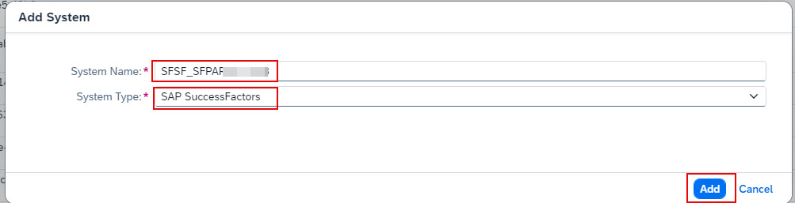
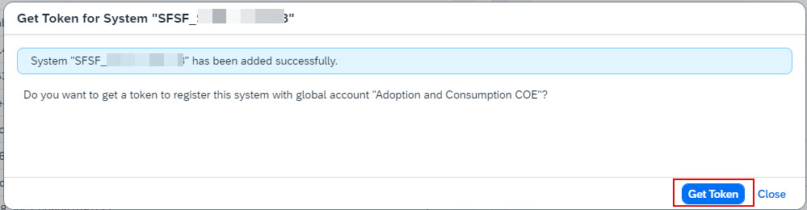
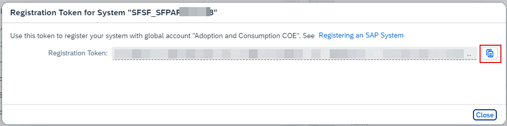
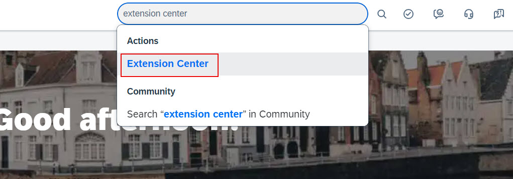
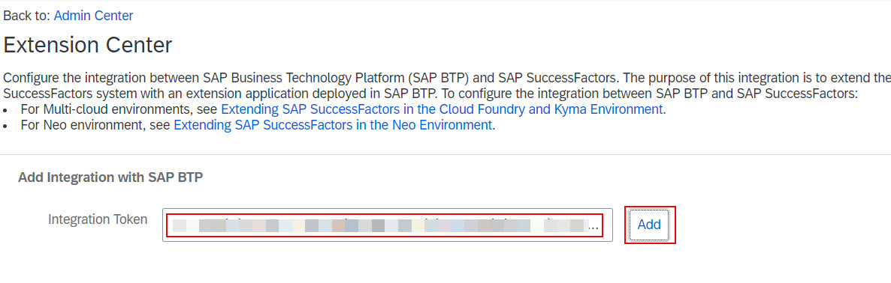
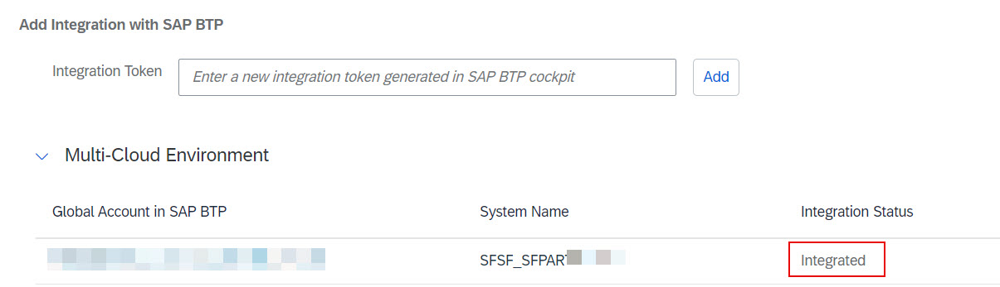
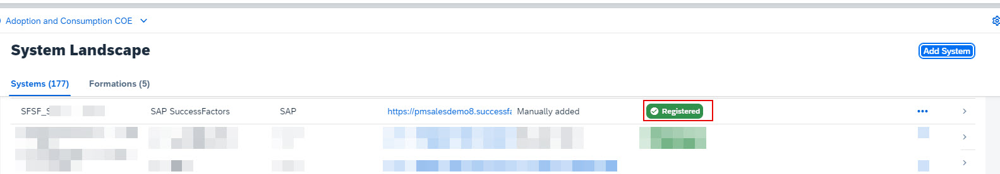

## **Create Subaccount and Cloud Foundry Space**

1. Access [BTP Cockpit URL](https://cockpit.btp.cloud.sap).
2. Select the BTP Global Account that has the Joule entitlements and click **Continue**.                        

3. From the Navigation Pane on the left, select **System Landscape**.  

4. Click **Add System**.                               
5. Specify a **System Name** of your choice and select **SAP SuccessFactors** from the **System Type** dropdown.   

6. Click **Get Token**.         

7. Copy the **Registration Token** value and share it with your SuccessFactors Admin.  Close the token registration screen.                                                          

**Note**: The **Region** must be from one of the supported data centers for Joule and correspond to your SuccessFactors tenant.  See [Data Center Mapping between SAP SuccessFactors and Joule](https://help.sap.com/docs/joule/serviceguide/data-center-mapping-between-sap-successfactors-and-joule)

8. Log into SAP SuccessFactors as an admin user and search for **Extension Center**.                                                                                                                    

**Note**: If you don't have access to Extension Center, follow the steps in the preparation section.

9. Paste the token received from the BTP admin into the ***Integration Token** text box and click **Add**.                                       

10. Confirm the integration status shows **Integrated**.                                                                                                                    

11. Confirm the status is updated to **Registered** in the BTP Cockpit.                                                                                                                    

**Note**: You may have to refresh the BTP Cockpit browser session to see the updated status.
