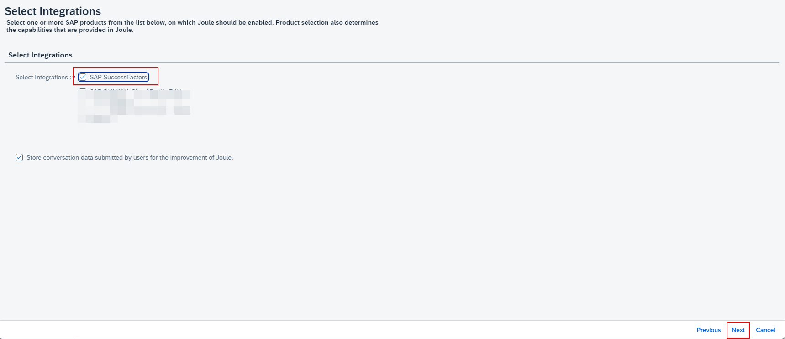
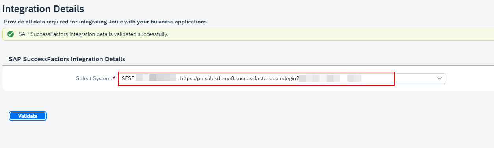

1. In BTP Cockpit, navigate to your BTP Global Account. 

2. From the Navigation Pane on the left, click **Boosters** >> search for **Joule** >> click **Start** on Setting up Joule tile. 

3. Confirm the pre-requisites check is successful and click **Next**. 

4. From the Subaccount dropdown select the **Joule** subaccount created earlier and click **Next**. 

5. Choose **SAP SuccessFactors** and click **Next**. 

7. From the **Select System** dropdown, select SAP SuccessFactors system registered earlier and click **Validate**. 

9. Confirm the validation is successful and click **Next**.
10. Validate the information on the summary screen and click **Finish**.

12. Confirm the booster execution is successful and click **Close**. 

