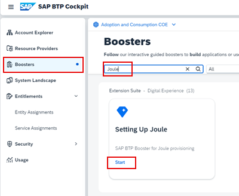
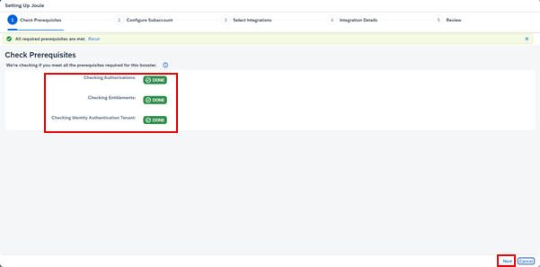
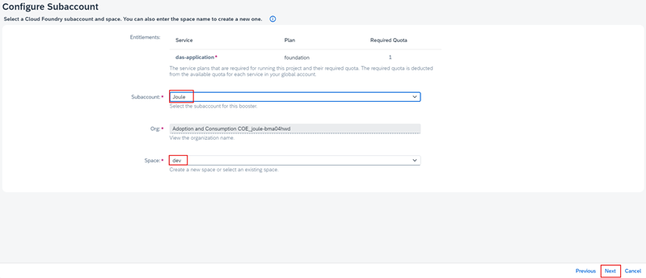
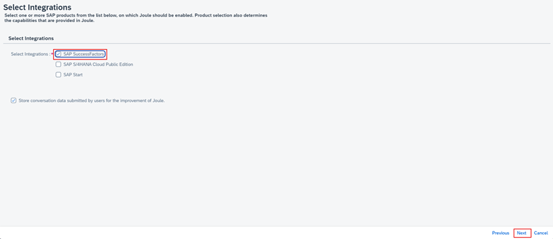
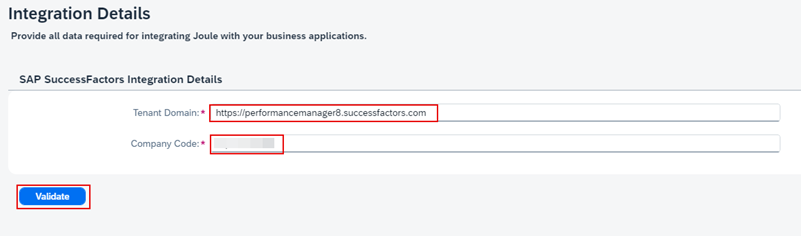

1. In BTP Cockpit, navigate to your BTP Global Account. 

2. From the Navigation Pane on the left, click **Boosters** >> search for **Joule** >> click **Start** on Joule tile. 

3. Confirm the pre-requisites check is successful and click **Next**. 

4. From the Subaccount dropdown select the **Joule** subaccount created earlier and click **Next**. 

5. Select **SAP SuccessFactors** and click **Next**. 

6. Specify the SuccesFactors **Tenant Domain**, **Company Code** and click **Validate**.                   
**Note**: Tenant domain should be entered without trailing forward slash at the end of the URL.  Customers already migrated to common super domain(CSD) should use the pre-CSD domain of their SucessFactors tenant. See preparation steps for more information.              
     

7. Confirm the validation is successful and click **Next**.
8. Validate the information on the summary screen and click **Finish**.
9. Confirm the booster execution is successful and click **Close**. 

