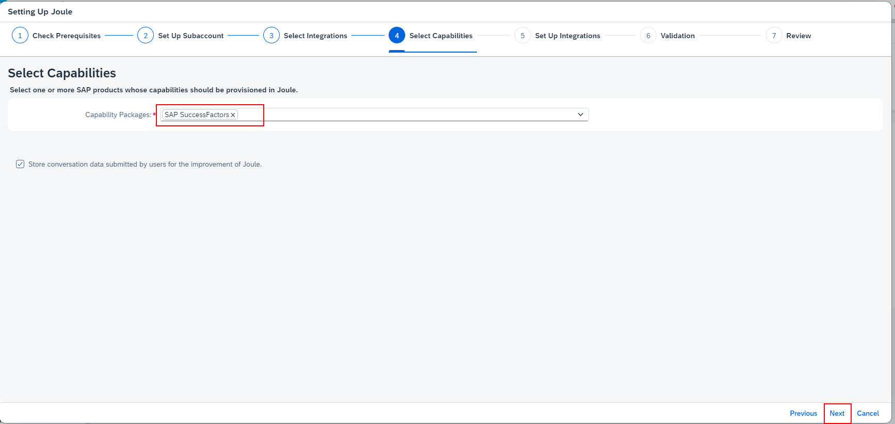
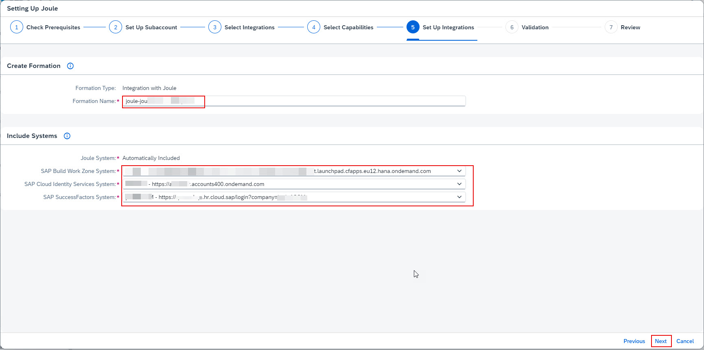

1. If necessary, navigate to your BTP Global Account. 

2. From the Navigation Pane on the left, click **Boosters** >> search for **Joule** >> click **Start** on Setting up Joule tile. 

3. Confirm the pre-requisites check is successful and click **Next**. 

4. From the Subaccount dropdown select the **Joule** subaccount created earlier and click **Next**. 

5. From the Products dropdown select **SAP SuccessFactors** and choose whether the integration is for **Testing or Production**.  Click **Next**. 

6. Confirm the **SAP SuccessFactors** is selected from the Capability Pacakages dropdown and click **Next**. 

7. Leave the default **Formation Name**.  From the SAP SuccessFactors System dropdown choose the SuccessFactors system registered under the BTP System Landscape in earlier steps.  For SAP Build Work Zone, select the SAP Build Work Zone subscription that you created earlier in BTP subaccount.  Similary for SAP Cloud Identity Services system, choose the system registered in BTP Global Account. The SAP Cloud Identity Services tenant chosen here must match what is used by SuccessFactors and what was selected during the setup of the BTP subaccount trust. Click **Next**.  

8. Confirm the validation check is successful and click **Next**. 
  

9. Review the configuration settings and click **Finish**. 
  

10. Confirm the booster execution is successful and click **Close**. 

