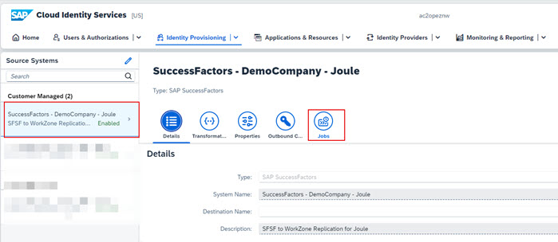
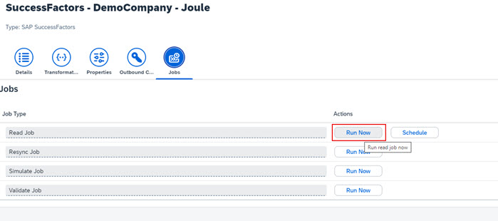
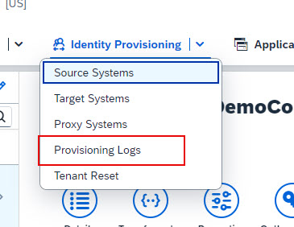
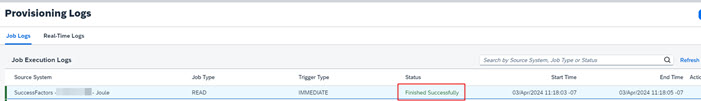
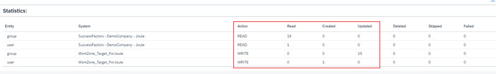

## **Run Provisioning Job in SAP Cloud Identity Provisioning Service**

1. Access the administration console of SAP Cloud Identity Services tenant using one of the URL formats below:
  * https://your-ias-tenant.accounts.ondemand.com/admin
  * https://your-ias-tenant.accounts.cloud.sap/admin              
  **Note**: Substitute your-ias-tenant with your actual tenant name.

2. Authenticate using an administrator user.                 
3. From the menu, access **Identity Provisioning >> Source Systems**.
4. Under **Source Systems** select the source system we created earlier for Joule integraton and click **Job**. 

5. Click **Run Now** to run the **Read job**.              

6. From the menu, access **Identity Provisioning >> Provisioning Logs**.             

7. Confirm the job executes successfully.                   
**Note**: It may take few minutes for the job to appear in this interface.  The job execution time will also vary depending upon number of users being read.  It may take up to 15 minutes to provision few users and groups that meet the filter criteria specified in the job properties.  For full user synch it can take several hours. 

8. Click the job to view the **Job Execution Details** and confirm users and groups that meet the filter criteria are created in Work Zone application.   

