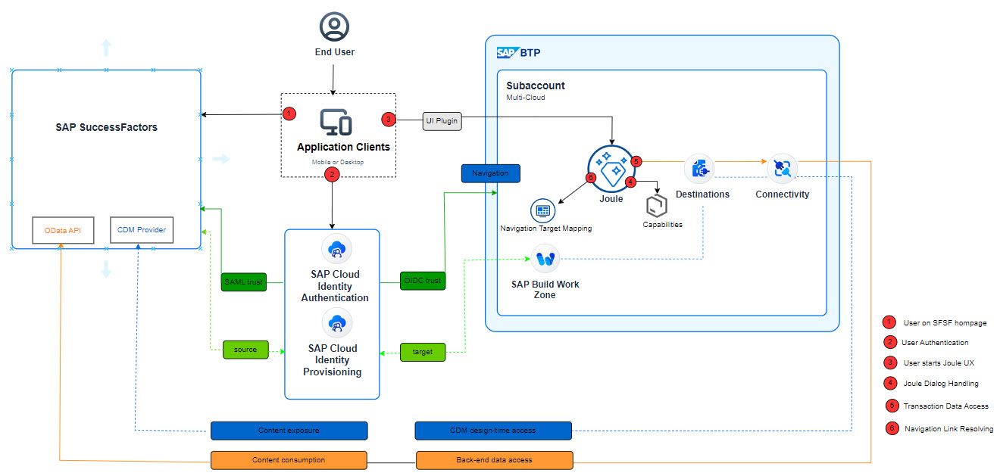

Joule is an AI-powered technology that delivers a copilot experience using natural language processing.  Joule offers transactional pattern to assist you with various tasks across SAP SuccessFactors products. In the transactional pattern, you can create, view, update, and delete information through interactions with Joule. Based on your requests, it provides real-time information in response to your queries or automates tasks so that you can complete them directly on the conversational user interface. By using Joule, you can easily interact with the system and increase your productivity.  Joule is Generally Available (GA) with SAP SuccessFactors.  For more information on Joule and other AI powered initiatives with SuccessFactors, have a look the following resources:

* [SAP SuccessFactors 2H 2023 Release Highlights](https://www.sap.com/documents/2023/10/943d147c-927e-0010-bca6-c68f7e60039b.html)
* [Demo - Interacting with Joule in SAP SuccessFactors](https://sapvideoa35699dc5.hana.ondemand.com/?entry_id=1_1gxt7zms)
* [Transactional Use Cases supported with Joule](https://help.sap.com/docs/joule/capabilities-guide/transactional-use-cases)

Joule will initially be available in English for US and European data centers and will be rolled out to other regions in 2024 and beyond.  Refer to [Data Center Mapping between SuccessFactors and Joule](https://help.sap.com/docs/joule/serviceguide/data-center-mapping-between-sap-successfactors-and-joule).

The setup process for Joule with SuccessFactors requires integration across multiple SAP components as depicted in the picture below. 

This purpose of this guide is to provide step by step instructions on how to set up Joule with SAP SuccessFactors.

