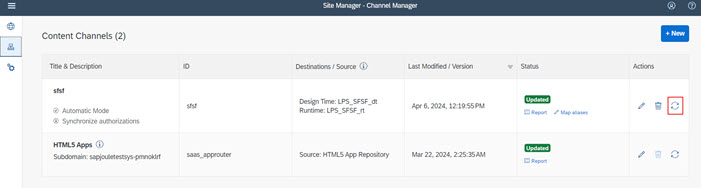
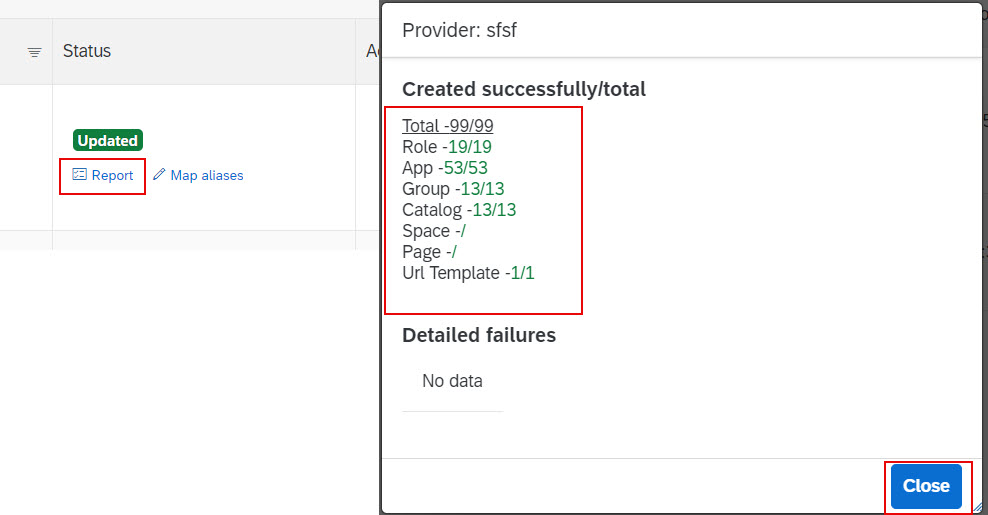
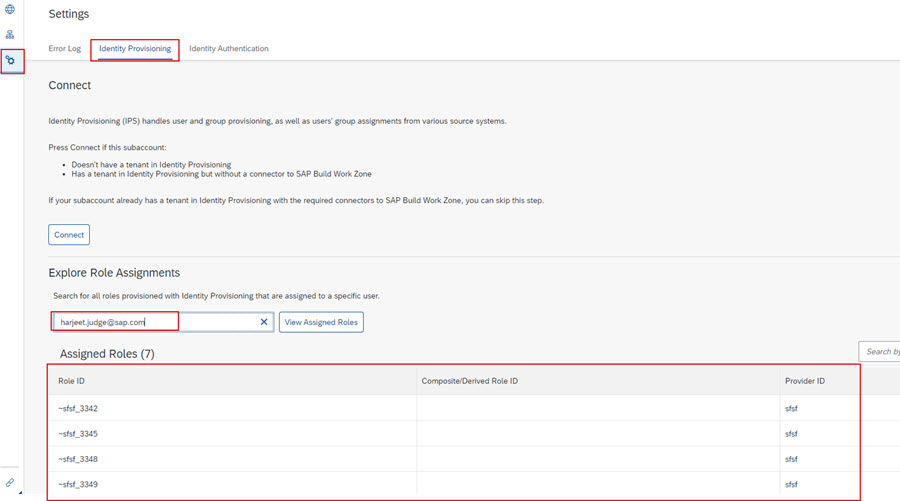

## **Optionally validate provisioned users in SAP Build Work Zone**

**Note**: In order to run through these steps you will need to ensure **Launchpad_Admin** role is assigned to the user accessing Work Zone.  Note that in earlier steps we only assigned this role to user from Default Identity Provider but we also disabled this IDP for authentication.  You may now need to assign this roles to user coming from your IAS tenant or temporarily enable the **Available for User Logon** option for **Default Identity Provider**.

1. Access [BTP Cockpit URL](https://cockpit.btp.cloud.sap).
2. Select the BTP Global Account that has the Joule entitlements and click **Continue**.
3. Select the BTP Subaccount where Joule was setup.                        
4. From the Navigation Pane on the left, select **Instances and Subscriptions***. Click **SAP Build Work Zone, standard edition** to launch the application.   
6. If prompted to choose the authentication provider, click **Default Identity Provider** or your SAP Cloud Identity Authentication Service URL.
7. Under **Channel Manager** click the **Update Content** icon. 
 
8. Click **Report** to see the content was successfully created for the SuccessFactors content provider. 
 
10. Click **Settings >> Identity Provisioning**. Under Explore Role Assignments section, search for user using their email and click **View Assigned Roles**.
**Note**: The user should have some roles assigned.  The **Provider id** should match what we setup in Work Zone specifically for Joule integration. 

